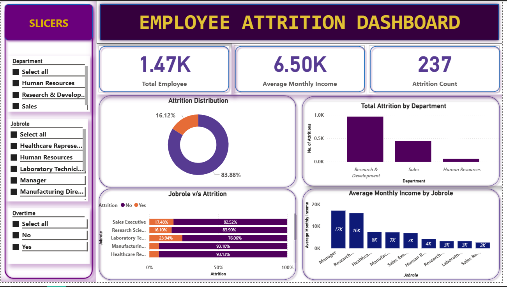

## Employee Attrition Analysis (SQL & Power BI)
## Project Overview

Employee attrition is a major challenge for organizations.
This project analyzes employee attrition patterns to identify key factors influencing employee turnover and provide actionable insights using SQL and Power BI.

## Objective

Analyze employee attrition trends across departments and job roles

Identify key drivers of attrition such as overtime and income

Build an interactive Power BI dashboard for HR decision-making

## Dataset

Source: IBM HR Analytics Employee Attrition Dataset (Kaggle)

Records: 1,470 employees

Key Columns: Department, JobRole, MonthlyIncome, OverTime, Attrition

## Tools & Technologies

Database: PostgreSQL

SQL Execution: pgAdmin / psql

Visualization: Power BI

Data Format: CSV

## Data Processing (SQL)

Imported CSV data into PostgreSQL using COPY command

Validated and cleaned categorical and numeric columns

Ensured correct data types for analysis

Performed aggregations for KPI and attrition analysis

## Key KPIs

Total Employees

Attrition Count

Attrition Rate (%)

Average Monthly Income

## Power BI Dashboard

[](dashboard_overview.png)

Interactive Power BI dashboard with KPIs, department-wise attrition, job role analysis, and slicers for dynamic filtering.

 ## Dashboard Features

KPI cards for high-level metrics

Attrition distribution (Yes / No)

Attrition by department and job role

Average monthly income by job role

Interactive slicers for:

Department

Job Role

OverTime

## Key Insights

Overall attrition rate is approximately 16%

Sales and Research departments show higher attrition

Employees working overtime have significantly higher attrition

Lower income bands experience increased employee turnover

## Business Recommendations

Reduce overtime workload in high-attrition departments

Review compensation strategy for lower income roles

Implement early-tenure retention programs

## Project Structure
```
Employee-Attrition-Analysis/
├── sql/
│   └── employee_attrition_analysis.sql
├── powerbi/
│   └── employee_attrition_dashboard.pbix
├── dataset/
│   └── HR_Employee_Attrition.csv
├── screenshots/
│   └── dashboard_overview.png
└── README.md
```

## Skills Demonstrated

SQL data cleaning and aggregation

KPI design and business analysis

Interactive Power BI dashboard development

Data storytelling and insight generation

## Conclusion

This project demonstrates an end-to-end data analytics workflow, from raw data ingestion and SQL analysis to interactive Power BI visualization and business insight generation.
